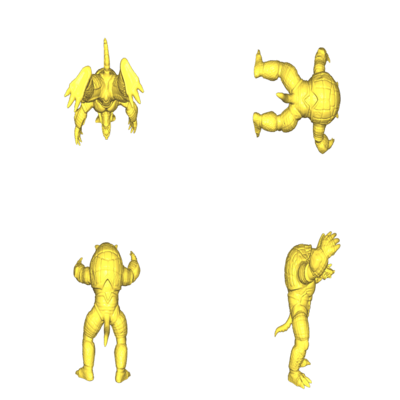

# Mesh Thumbnailer

A simple program to create thumbnails for meshes using [libigl](https://github.com/libigl/libigl/).

## Usage

Run `./mesh_thumbnailer mesh.obj` to create a thumnail `mesh.png`.

Currently only `obj` and `off` fileformats are supported and the format will be inferred by the file extension.

## Example image

## Known Bugs

The program shortly opens a window during rendering.
